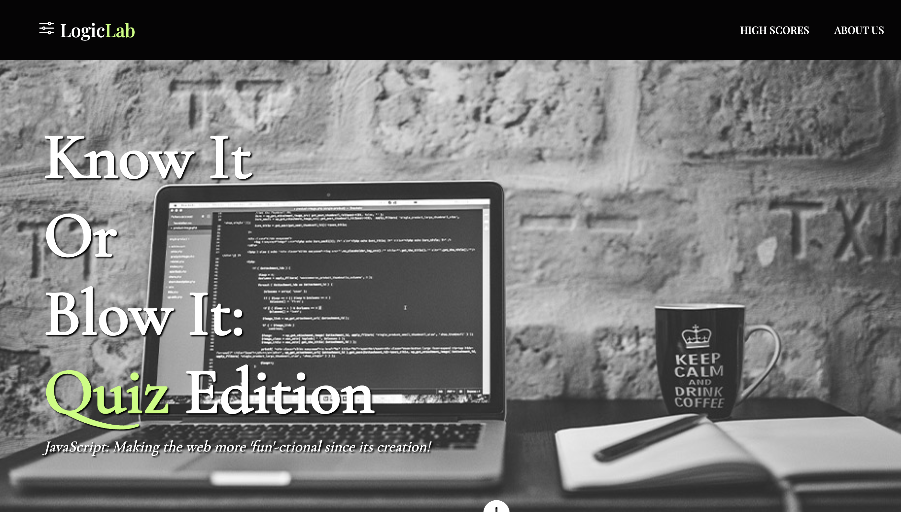
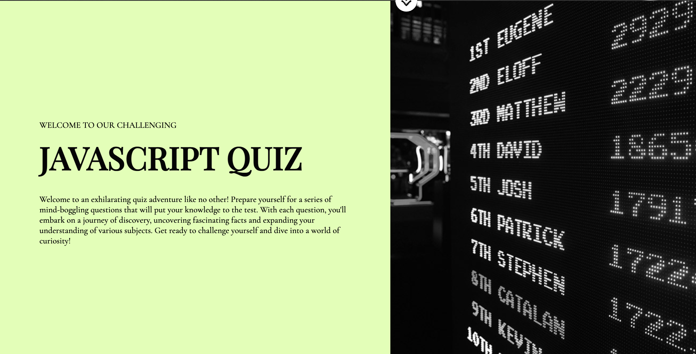
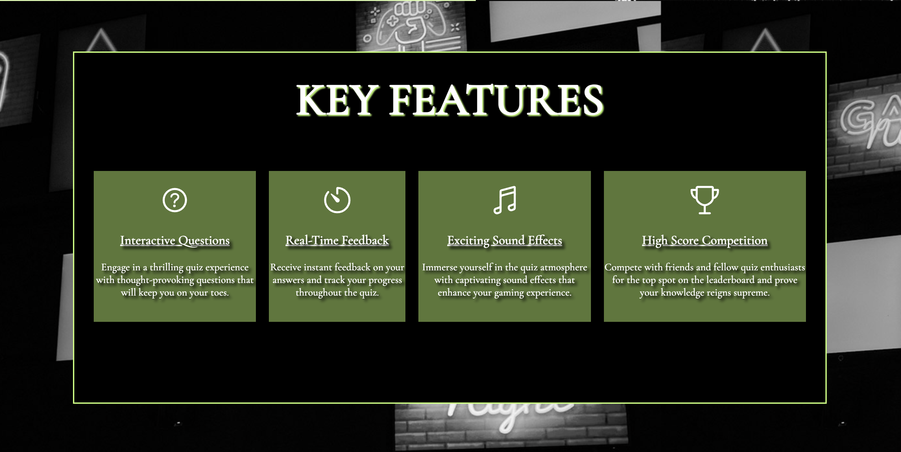
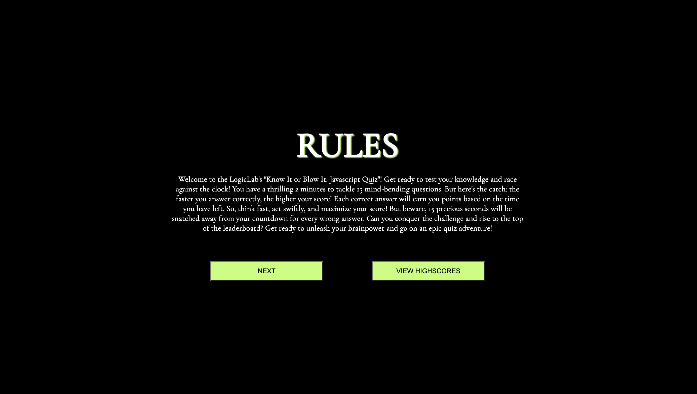
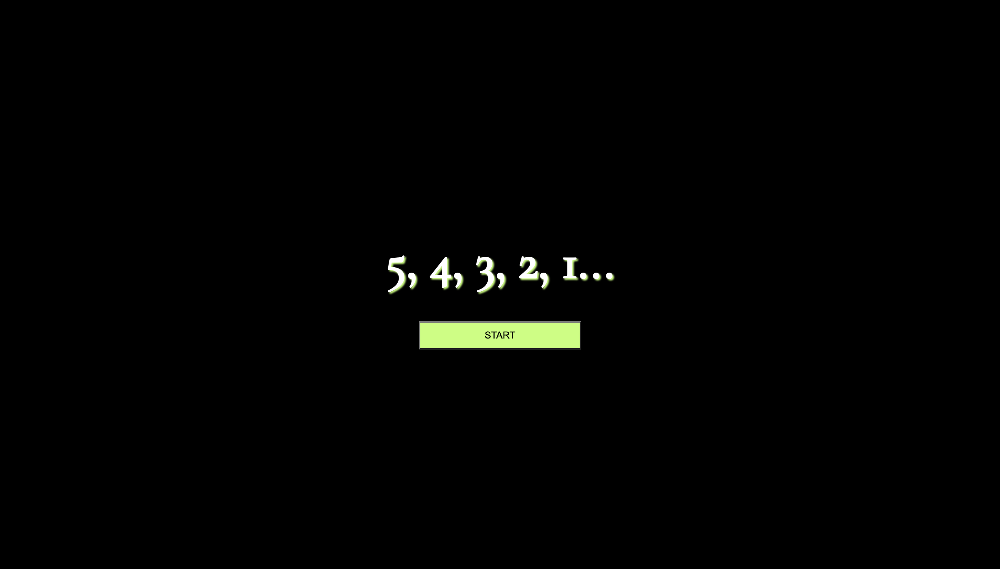
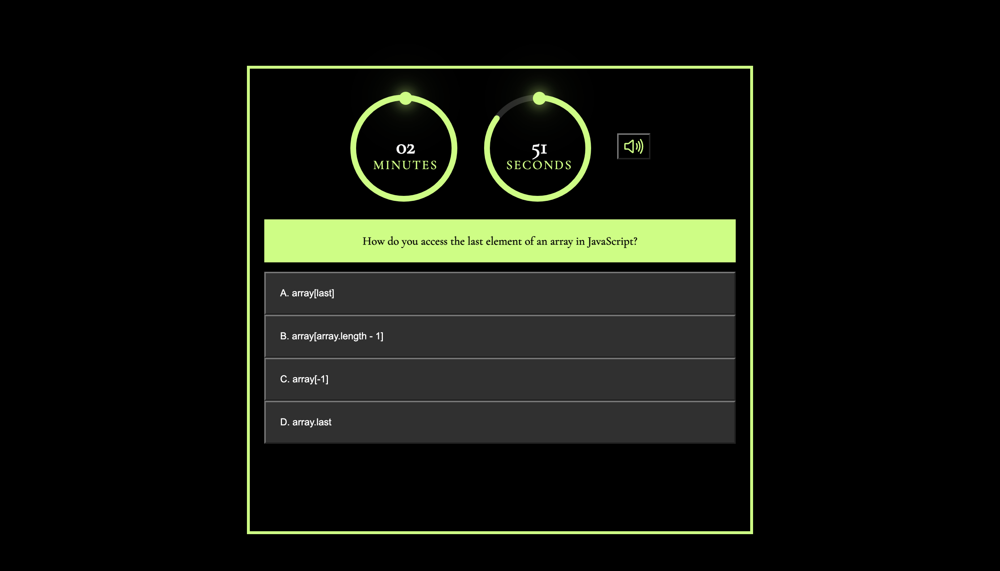
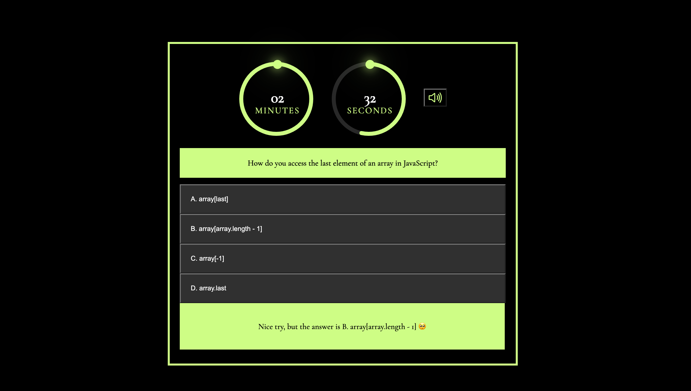
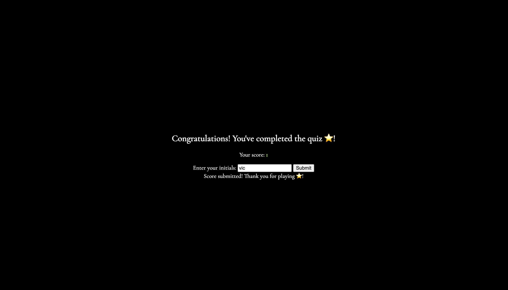
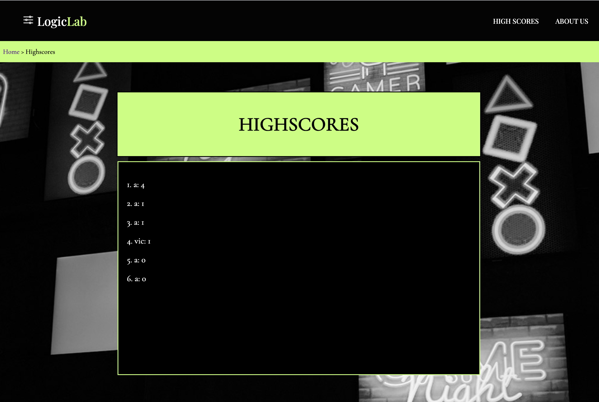

# Logic Lab's Know-It or Blow-It JavaScript Quiz

## Overview
Welcome to Logic Lab's Know-It or Blow-It JavaScript Quiz. This engaging and dynamic code quiz presents an excellent way to test and improve your JavaScript knowledge. The quiz begins when you hit the start button, activating a countdown timer and presenting you with your first question. With each question answered, a new one will appear, making your learning experience fun and challenging. However, be cautious; incorrect answers will result in a deduction of your remaining time. The quiz ends when all questions have been answered or the timer reaches zero, following which, you can save your initials and score.

## Features
- Interactive Questions: Engage in a thrilling quiz experience with thought-provoking questions that will keep you on your toes.
- Real-Time Feedback: Receive instant feedback on your answers and track your progress throughout the quiz.
- Exciting Sound Effects: Immerse yourself in the quiz atmosphere with captivating sound effects that enhance your gaming experience.
- High Score Competition: Compete with friends and fellow quiz enthusiasts for the top spot on the leaderboard and prove your knowledge reigns supreme.

## Usage Guide
- Navigate to the quiz start page.
- Click on the Next button. The timer begins, and your first question is displayed.
- Answer the question by clicking on one of the presented options.
- The quiz proceeds with the next question, regardless of whether your previous answer was correct or not.
- In case of an incorrect answer, time will be deducted from the timer.
- The quiz ends when all questions are answered, or the timer reaches zero.
- At the end of the quiz, enter your initials and click 'submit to save your score.

## Screenshots

## Technologies Used
- HTML
- CSS
- JavaScript
- Ionic Icons (Icon library)

## Live Demo
Check out the live version of this project [here](https://lightoftwelve.github.io/its-quiz-time).

## Credits
This project was independently developed by Victoria Alawi. Inspiration for the style and functionality of the timer is from https://www.patreon.com/onlinetutorials // 
The project titled: Countdown Timer in Vanilla Javascript | CSS SVG Circle Countdown Time Animation

- Github: [@lightoftwelve](https://github.com/lightoftwelve)
- LinkedIn: [@Victoria Alawi](https://www.linkedin.com/in/victoria-alawi-872984250/)
- Website: [www.lightoftwelve.com](http://www.lightoftwelve.com)

## Acknowledgements
I want to express my gratitude to my teacher, Sean Roshan, and TA, Serena Guo, for their invaluable guidance and support in the structuring of this project.

## License
This project is not currently licensed.
